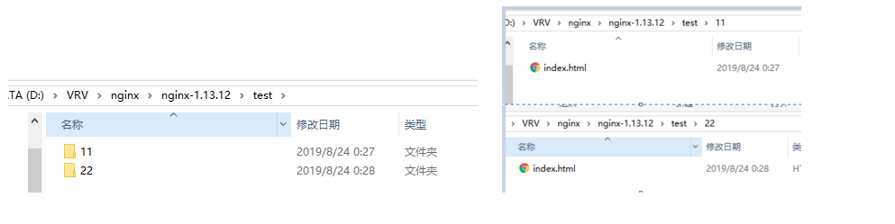

# nginx-demo


nginx的静态页面代理：

=========================================对比验证图===============================================

对比访问请求，直接跳转到页面， **location可以带斜杠有可以不带斜杠**

| uri不带斜杠   | location /11  {     root test;             index index.html index.htm;       } | URI：http://127.0.0.1:9999/11/ 访问成功 目录：test/11/index.html | [http://127.0.0.1:9999/11](http://127.0.0.1:9999/11/) 访问成功，会自动跳转到 http://127.0.0.1:9999/11/ 目录：test/11/index.html |
| ------------- | ------------------------------------------------------------ | ------------------------------------------------------------ | ------------------------------------------------------------ |
| uri最后带斜杠 | location /22/ {  root test;  index index.html index.htm; }   | http://127.0.0.1:9999/22/ 访问成功 test/22/index.html        | [http://127.0.0.1:9999/22](http://127.0.0.1:9999/22/) 访问失败404 |




[[对比图\]:]: https://github.com/ljh205sy/nginx-demo/blob/master/1.png	" dddd"

本地测试nginx的使用及反向代理结论：

**在nginx中配置proxy_pass代理转发时，如果在****proxy_pass后面的url加/，表示绝对根路径****；****如果没有/，表示相对路径****，把匹配的路径部分也给代理走。**

**假设下面四种情况分别用 http://192.168.1.1/proxy/test.html 进行访问。\**location一定带斜杠，proxy_pass可以不带\****


```shell
 server {
        listen       10001;
        server_name  localhost; 
		
		# 浏览器请求:    http://127.0.0.1:10001/proxy/html/show.html
		# 代理url, http://127.0.0.1:10001/html/show.html      根路径, 前面的请求被吃掉了, proxy_pass最后带斜杠/
		
		location /proxy/ {
		   proxy_pass   http://127.0.0.1:8001/;
		}

		# 浏览器请求:  http://127.0.0.1:10001/test/html/index.html
		# 代理url, http://127.0.0.1:10001/test/html/index.html        绝对路径,    绝对路径就是把前面都加上
		# 访问tomcat的8001端口，http://127.0.0.1:8001/test/html/index.html   返回真正的结果， 被nginx反向代理
		location /test/ {
		   proxy_pass   http://127.0.0.1:8001;
		}
		
		
		# 浏览器请求:  http://127.0.0.1:10001/test3/index.html
		# 代理url,  http://127.0.0.1:10001/test3/index.html      根路径, 前面的请求被吃掉了, proxy_pass最后带斜杠/ 
		# 访问tomcat的8001端口，http://127.0.0.1:8001/aaa/index.html   返回真正的结果， 被nginx反向代理
		location /test3/ {
		   proxy_pass   http://127.0.0.1:8001/aaa/;
		}
		
		
		# 与下面形成对比， location中最后加斜杠和不加斜杠，得到的值不一样。  不加斜杠获取的是aaa/index.html.   加斜杠获取的是aaaindex.html页面。   谨记谨记
		# 浏览器请求:  http://127.0.0.1:10001/test4/index.html
		# 访问tomcat的8001端口， http://127.0.0.1:8001/aaa/index.html
		location /test4 {
		   proxy_pass   http://127.0.0.1:8001/aaa;
		}
		
		
		# 单独打开此和上面的一并打开，返回的结果会不一致
		# 与上面一起打开，会走当前（把上面的覆盖掉），获取值
		# 单独打开上面的， 走上面获取数据。
		# 浏览器请求:  http://127.0.0.1:10001/test4/index.html
		# 代理url                                                         绝对路径， test4被吃掉了，然后在aaa上追加index.html页面
		# 访问tomcat的8081端口，http://127.0.0.1:8001/aaaindex.html
		#location /test4/ {
		#   proxy_pass   http://127.0.0.1:8001/aaa;
		#}
		
		
		# 代理前端静态html页面
		location /11 {
			root   test;
			index  index.html index.htm;
		}
		
		location /22/ {
			root   test;
			index  index.html index.htm;
		}
		
		location /aa/ {
			root  D:\VRV\nginx\nginx-1.13.12\test;
			index  index.html index.htm;
		}
		
		location / {
			root  html;
			index index.html index.htm;
		}
		
    }

```

